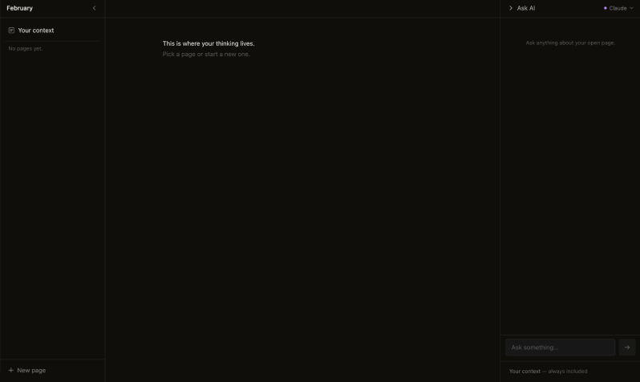

# February

Your context shouldn't be locked inside a tool. It should be yours — versioned, portable, readable by any AI.

February is a local-first interface for externalising your context. Markdown files underneath, Git versioning silent, any AI can read them. Clone it, run one command, start writing. The model is interchangeable. The context stays yours.



---

## Requirements

- **Node.js 18+** — [nodejs.org](https://nodejs.org/)
- An Anthropic or OpenAI API key — optional, only needed for the AI panel

---

## Run it

```
git clone https://github.com/tonhaoln/february-os.git
cd february-os
npm install
npm start
```

Browser opens. Your workspace is ready. If it doesn't, go to `localhost:5173`.

---

## API key

Optional. You can write and organise pages without one.

With a key, the AI panel lets you ask questions scoped to your files.
After a few exchanges, it suggests updates to your context — shows a diff, one click to commit.

Get one at [console.anthropic.com](https://console.anthropic.com) or [platform.openai.com](https://platform.openai.com).
Enter it on first use in the AI panel — stored locally in `.env`.

---

## What it does

- Write in a clean editor — no markdown syntax visible
- Every save commits to Git automatically
- Ask AI questions scoped to your open page and your context
- Your context file is always in every query — your session anchor

---

## Where your files live

Everything is in `./content/` inside the repo. Plain Markdown, Git-versioned.

Open `./content/` in your file explorer — what you write in February is already a `.md` file, live and in sync.

Copy the folder, open it in Cursor, point another AI at it. Nothing to export.

---

**Status:** Early. Working. Building in public.

Built by [antoniodesign.work](https://www.antoniodesign.work/)

**Licence:** MIT
